# Garage WebUI — Enhanced Fork

[](misc/img/garage-webui.png)

A **production-ready** admin web UI for [Garage](https://garagehq.deuxfleurs.fr/), a self-hosted S3-compatible distributed object storage service. This fork adds **11 major features** on top of the upstream project, including multi-user RBAC, presigned URL sharing, lifecycle rules, file preview, bulk operations, and more.

> **Fork of:** [khairul169/garage-webui](https://github.com/khairul169/garage-webui) (v1.1.0) | **Fork maintainer:** [@leojadue](https://github.com/leojadue) — XGOLD IT

---

## Feature Comparison

| Feature | Upstream | This Fork |
|---------|:--------:|:---------:|
| Cluster health dashboard | Yes | **Enhanced** (gauges + analytics) |
| Bucket management | Yes | Yes |
| Object browser (upload/download) | Yes | Yes |
| Access key management | Yes | Yes |
| Basic auth (single user) | Yes | Yes |
| **S3 Presigned URL sharing** | No | **Yes** |
| **Object rename** | No | **Yes** |
| **Object move (cross-bucket)** | No | **Yes** |
| **Multi-select bulk delete** | No | **Yes** |
| **Create virtual folders** | No | **Yes** |
| **Inline file preview** (img/txt/pdf) | No | **Yes** |
| **Download as ZIP** | No | **Yes** |
| **Folder upload** | No | **Yes** |
| **Lifecycle rules management** | No | **Yes** |
| **Multi-user RBAC** (admin/editor/viewer) | No | **Yes** |
| Mobile responsive | Yes | Yes |
| Theming (20+ DaisyUI themes) | Yes | Yes |

---

## What's New in This Fork

### 1. Multi-User Role-Based Access Control (RBAC)

The biggest addition: **three user roles** with granular permission gating at both backend (middleware) and frontend (UI) layers.

```
                    ┌─────────────────────────────────────────┐
                    │           Role Hierarchy                │
                    ├─────────────────────────────────────────┤
                    │                                         │
                    │   admin ──── Full access                │
                    │     │        Cluster, Keys, Users,      │
                    │     │        Lifecycle write, API proxy  │
                    │     │                                    │
                    │   editor ── Upload, delete, rename,     │
                    │     │        move objects                │
                    │     │                                    │
                    │   viewer ── Browse, download, preview,  │
                    │              share (read-only)           │
                    │                                         │
                    └─────────────────────────────────────────┘
```

**How it works:**

- Set `DATA_DIR=/data` environment variable to enable multi-user mode
- On first boot, an admin user is auto-created from `AUTH_USER_PASS`
- Admin can create additional users via the **Users** page
- Each user gets a role: `admin`, `editor`, or `viewer`
- Without `DATA_DIR`, the app works exactly like upstream (single user, no changes needed)

**Backend enforcement (defense in depth):**

| Route | Required Role |
|-------|---------------|
| `GET /browse/*`, `/presign/*`, `/zip/*` | viewer |
| `PUT/DELETE /browse/*`, `POST /objects/copy` | editor |
| `POST/DELETE /lifecycle/*` | admin |
| `/users/*` (CRUD) | admin |
| `PUT /users/{id}/password` | admin OR self |
| `/` (Garage Admin API proxy) | admin |

**Frontend gating:**
- Sidebar menu items hidden based on role (Cluster, Keys, Users for admin only)
- Upload/delete/rename/move buttons hidden for viewers
- Checkboxes and bulk actions hidden for viewers
- Lifecycle rule edit/delete/toggle hidden for non-admin
- Username and role badge displayed in sidebar and header

**Technical details:**
- SQLite database via `modernc.org/sqlite` (pure Go, no CGO — works with `scratch` Docker image)
- Session store backed by SQLite (persistent across container restarts)
- Automatic session cleanup every 5 minutes
- Last-admin protection: cannot delete, demote, or deactivate the only admin user

### 2. S3 Presigned URL Sharing

Share any file with a **time-limited, cryptographically signed URL** — no wildcard DNS or website access needed.

- 7 expiration options: 15 minutes to 7 days
- One-click copy to clipboard
- Open in browser button
- Works through the standard S3 API endpoint

```
GET /api/presign/{bucket}/{key}?expires=3600
→ { "url": "https://s3.domain.com/bucket/key?X-Amz-Algorithm=...", "expiresIn": 3600 }
```

### 3. Object Rename & Move

- **Rename:** In-place rename using S3 CopyObject + DeleteObject
- **Move:** Cross-bucket and cross-folder move with directory support
- Recursive directory operations (move entire folder trees)

### 4. Inline File Preview

Preview files without downloading:
- **Images:** jpg, png, gif, svg, webp (with thumbnail generation)
- **Text:** txt, json, xml, yaml, md, csv, log
- **PDF:** In-browser PDF viewer

### 5. Bulk Operations

- Checkbox selection for files and folders
- Select all / deselect all
- Bulk delete with confirmation dialog
- Error-resilient: tracks success/failure count for each operation

### 6. Lifecycle Rules Management

Full UI for S3 lifecycle rule management:
- Create, edit, delete lifecycle rules
- Toggle rules enabled/disabled
- Set object expiration days
- Set abort incomplete multipart upload days
- Per-prefix rule targeting

### 7. Enhanced Dashboard

- Cluster health gauges (visual status indicators)
- Per-bucket storage analytics
- Quick-access bucket cards

### 8. Folder Operations

- **Create virtual folders** (S3 prefix with trailing `/`)
- **Upload entire folders** (preserving directory structure)
- **Download folders as ZIP** (server-side compression)

---

## Screenshots

### Multi-User RBAC

| Users Management (Admin) | Create User Dialog |
|:------------------------:|:------------------:|
| [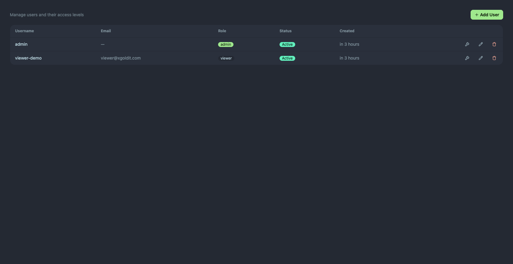](misc/img/users-table-two-users.png) | [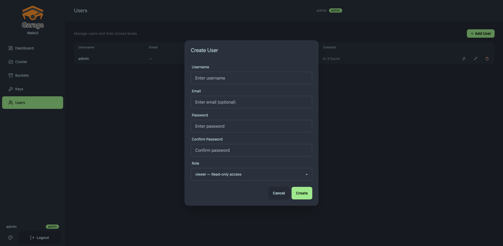](misc/img/create-user-dialog.png) |

| Admin View (5 menu items) | Viewer View (2 menu items) |
|:--------------------------:|:--------------------------:|
| [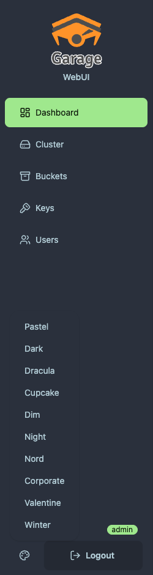](misc/img/sidebar-admin-rbac.png) | [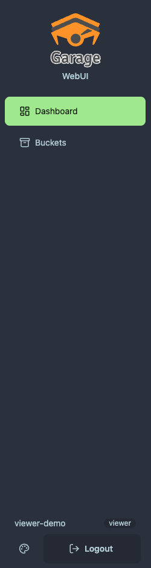](misc/img/sidebar-viewer-rbac.png) |

| Browse as Admin (checkboxes, upload, delete) | Browse as Viewer (read-only) |
|:--------------------------------------------:|:----------------------------:|
| [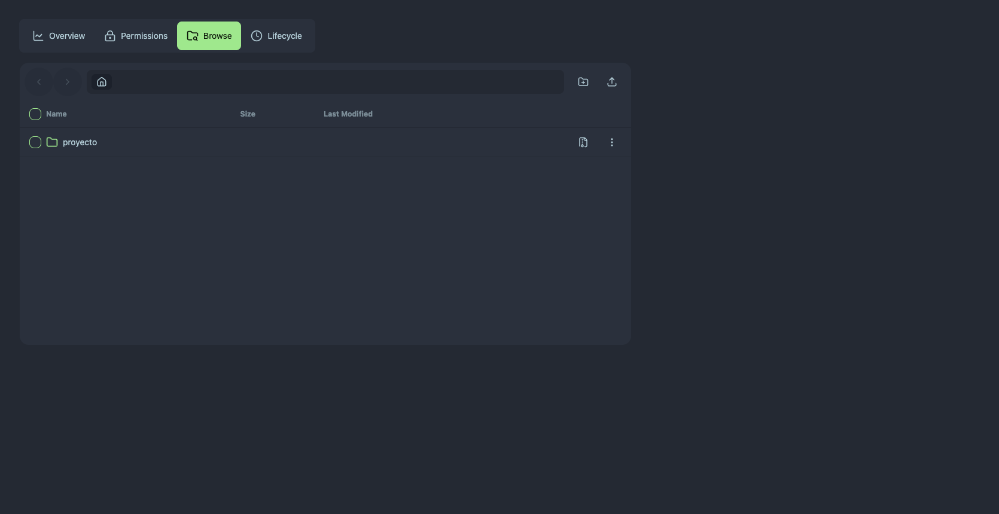](misc/img/browse-admin-view.png) | [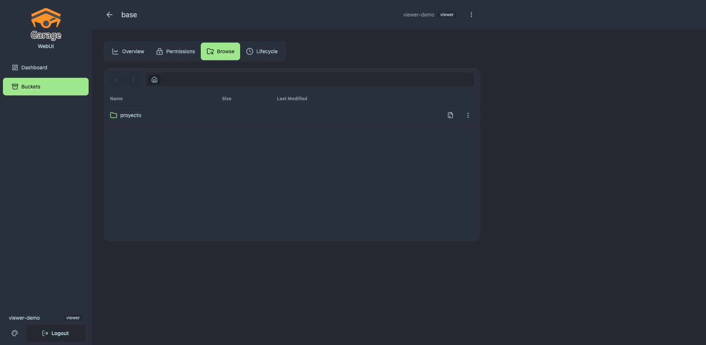](misc/img/browse-viewer-view.png) |

### General

| Dashboard | Buckets | Object Browser |
|:---------:|:-------:|:--------------:|
| [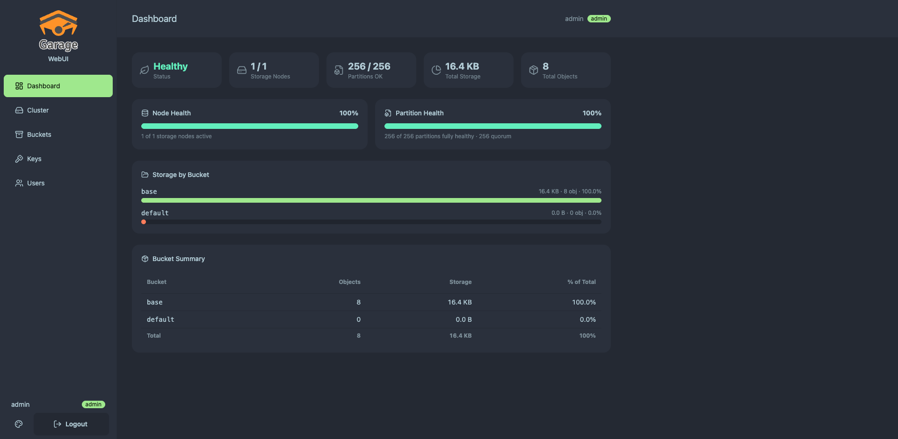](misc/img/home.png) | [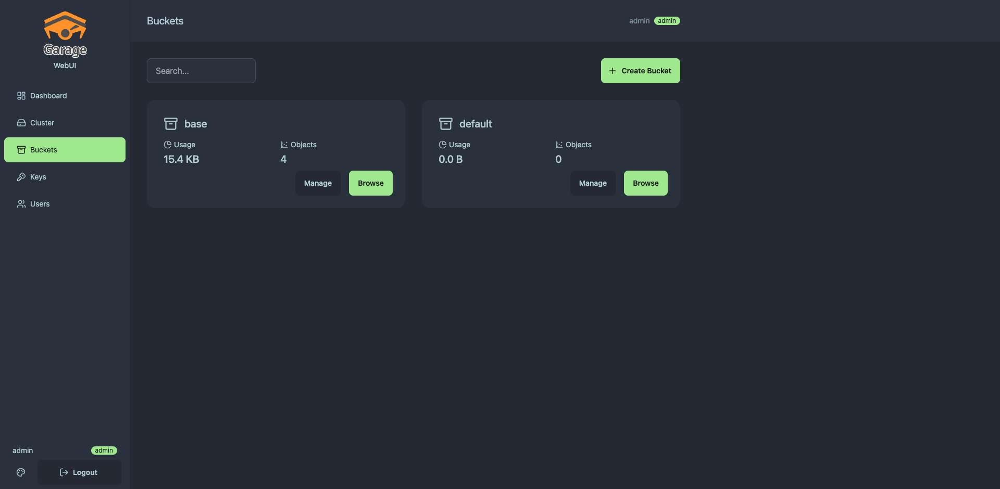](misc/img/buckets.png) | [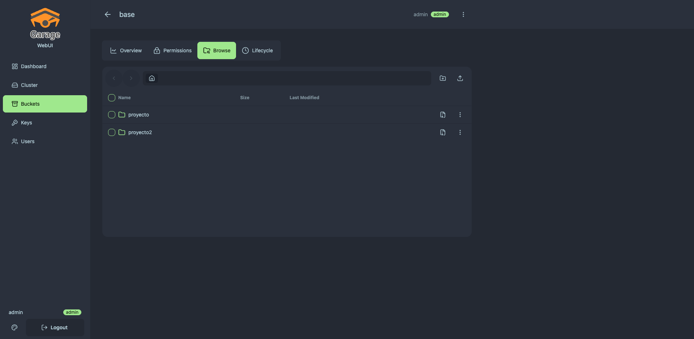](misc/img/buckets-browse.png) |

| Sharing | Cluster | Keys |
|:-------:|:-------:|:----:|
| [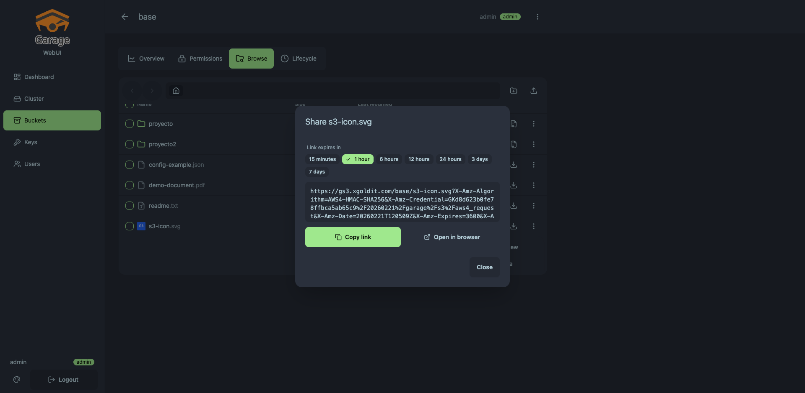](misc/img/buckets-browse-sharing.png) | [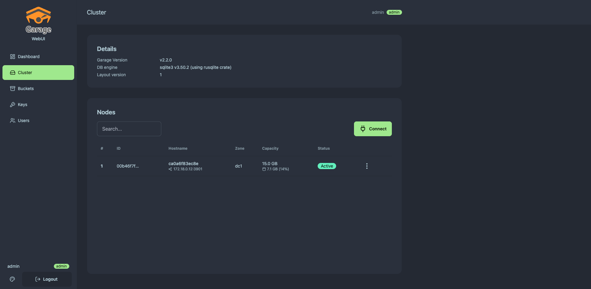](misc/img/cluster.png) | [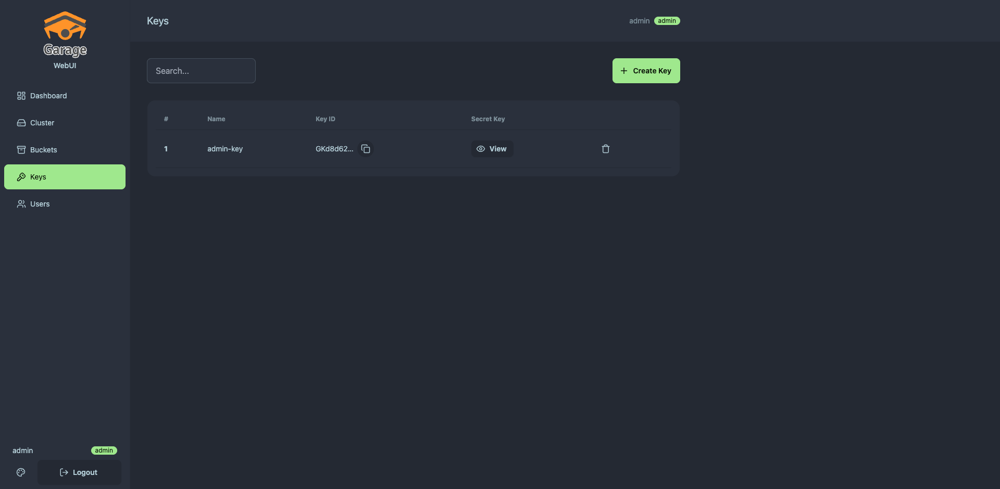](misc/img/keys.png) |

<details>
<summary>Mobile Views</summary>

| Dashboard | Cluster | Buckets | Browse |
|:---------:|:-------:|:-------:|:------:|
| [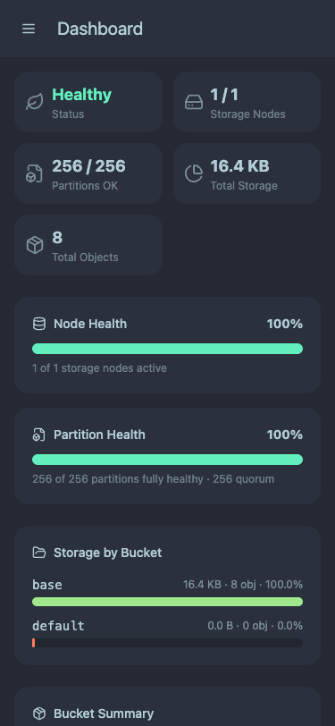](misc/img/mobile-dashboard.png) | [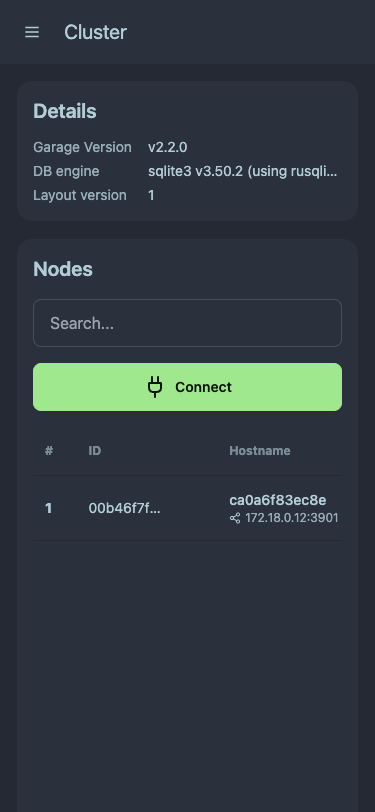](misc/img/mobile-cluster.png) | [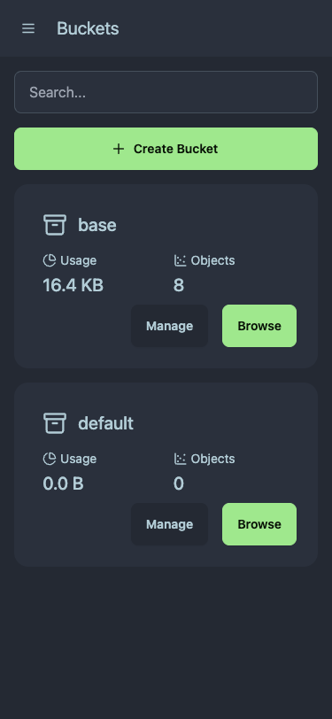](misc/img/mobile-buckets.png) | [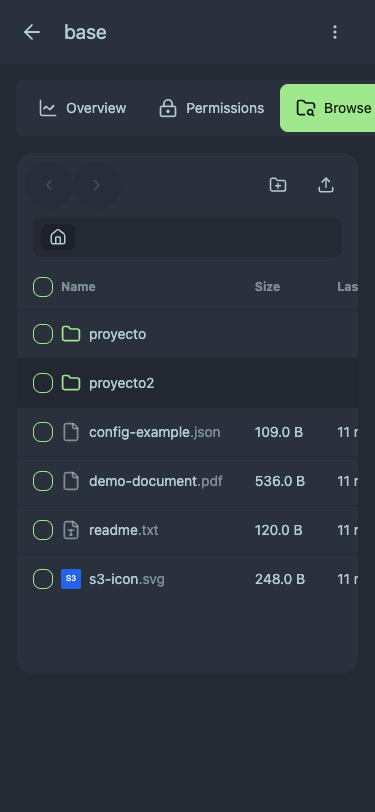](misc/img/mobile-bucket-browse.png) |

</details>

---

## Installation

### Docker Compose (Recommended)

```yaml
services:
  garage:
    image: dxflrs/garage:v2.2.0
    container_name: garage
    volumes:
      - ./garage.toml:/etc/garage.toml
      - ./meta:/var/lib/garage/meta
      - ./data:/var/lib/garage/data
    restart: unless-stopped
    ports:
      - "3900:3900"  # S3 API
      - "3902:3902"  # S3 Web
    healthcheck:
      test: ["CMD", "curl", "-f", "http://localhost:3903/v2/GetClusterHealth"]
      interval: 30s
      timeout: 5s
      retries: 3

  garage-webui:
    image: leojadue/garage-webui:latest
    container_name: garage-webui
    restart: unless-stopped
    ports:
      - "3909:3909"
    volumes:
      - ./garage.toml:/etc/garage.toml:ro
      - webui-data:/data                    # Required for multi-user mode
    environment:
      API_BASE_URL: "http://garage:3903"
      API_ADMIN_KEY: "${GARAGE_ADMIN_TOKEN}"
      S3_ENDPOINT_URL: "https://s3.yourdomain.com"
      AUTH_USER_PASS: "${GARAGE_WEBUI_AUTH}"
      DATA_DIR: "/data"                     # Enable multi-user RBAC
    depends_on:
      garage:
        condition: service_healthy

volumes:
  webui-data:
```

### Single User Mode (Legacy)

Remove `DATA_DIR` and the `webui-data` volume to run in single-user mode (identical to upstream):

```yaml
  garage-webui:
    image: leojadue/garage-webui:latest
    environment:
      API_BASE_URL: "http://garage:3903"
      S3_ENDPOINT_URL: "https://s3.yourdomain.com"
      AUTH_USER_PASS: "admin:$$2a$$10$$..."   # bcrypt hash
```

### Generate Password Hash

```bash
# Using Python
python3 -c "import bcrypt; print(bcrypt.hashpw(b'yourpassword', bcrypt.gensalt()).decode())"

# Using htpasswd
htpasswd -nbBC 10 "" yourpassword | cut -d: -f2
```

### Docker CLI

```bash
docker build -t garage-webui .

docker run -p 3909:3909 \
  -v ./garage.toml:/etc/garage.toml:ro \
  -v webui-data:/data \
  -e API_BASE_URL="http://garage:3903" \
  -e S3_ENDPOINT_URL="https://s3.yourdomain.com" \
  -e AUTH_USER_PASS='admin:$2a$10$...' \
  -e DATA_DIR="/data" \
  leojadue/garage-webui:latest
```

---

## Environment Variables

| Variable | Required | Default | Description |
|----------|:--------:|---------|-------------|
| `API_BASE_URL` | No* | From garage.toml | Garage Admin API endpoint (internal) |
| `API_ADMIN_KEY` | No* | From garage.toml | Garage Admin API token |
| `S3_ENDPOINT_URL` | No* | From garage.toml | **Public** S3 endpoint (for presigned URLs) |
| `AUTH_USER_PASS` | No | _(disabled)_ | `username:bcrypt_hash` for authentication |
| `DATA_DIR` | No | _(disabled)_ | Path to data directory — enables multi-user RBAC |
| `BASE_PATH` | No | _(empty)_ | URL prefix for reverse proxy setups |
| `PORT` | No | `3909` | HTTP listen port |
| `HOST` | No | `0.0.0.0` | Listen address |

> \* If `garage.toml` is mounted, these are read automatically. Env vars override the config file.
>
> **Important:** `S3_ENDPOINT_URL` must be the **publicly accessible** S3 API URL. Presigned URLs are generated with this endpoint and must be reachable by the end user's browser.

---

## Architecture

```
┌──────────────────────────────────────────────────────┐
│                     Browser                           │
│           garage.domain.com:3909                      │
└────────┬──────────────────────────────┬───────────────┘
         │ WebUI (React + DaisyUI)      │ Presigned URL
         │ Auth ← usePermission()       │ (direct S3)
         ▼                              ▼
┌──────────────────────┐     ┌──────────────────────┐
│   garage-webui       │     │    Garage S3 API     │
│   (Go backend)       │     │  s3.domain.com:3900  │
│   Port 3909          │     │                      │
│                      │     │  AWS Sig V4 auth     │
│   Auth Middleware ────┤     │  Path-style URLs     │
│   Role Middleware ────┤     └──────────────────────┘
│   Session (SQLite) ───┤
│                      │
│   /api/presign/ ──────┤── S3 SDK (presign)
│   /api/browse/  ──────┤── S3 SDK (get/put/delete)
│   /api/users/   ──────┤── SQLite (user CRUD)
│   /api/*        ──────┤── Proxy → Garage Admin API
└──────────────────────┘
         │ Admin API
         ▼
┌──────────────────────────┐
│      Garage Server       │
│   Port 3903 (Admin API)  │
│   Port 3900 (S3 API)     │
│   Port 3902 (S3 Web)     │
└──────────────────────────┘
```

### Multi-User Mode Data Flow

```
First Boot:
  1. DATA_DIR=/data → SQLite database created at /data/webui.db
  2. Migrations run (roles table + users table + sessions table)
  3. 3 roles seeded: admin, editor, viewer
  4. AUTH_USER_PASS parsed → admin user created in DB

Login:
  1. POST /api/auth/login {username, password}
  2. Backend: bcrypt compare against users table
  3. Session: {user_id, username, role} stored in SQLite
  4. Frontend: useAuth() hook fetches user info
  5. usePermission() calculates canWrite, isAdmin, etc.
  6. UI renders based on permissions
```

---

## API Endpoints

### Public (No Auth Required)

| Method | Endpoint | Description |
|--------|----------|-------------|
| POST | `/api/auth/login` | Login with username/password |
| GET | `/api/auth/status` | Check auth status + user info |

### Viewer (Any Authenticated User)

| Method | Endpoint | Description |
|--------|----------|-------------|
| POST | `/api/auth/logout` | Logout |
| GET | `/api/config` | Garage configuration |
| GET | `/api/buckets` | List buckets |
| GET | `/api/browse/{bucket}` | List objects |
| GET | `/api/browse/{bucket}/{key}` | Get/view/download object |
| GET | `/api/presign/{bucket}/{key}` | Generate presigned URL |
| GET | `/api/zip/{bucket}` | Download as ZIP |
| GET | `/api/lifecycle/{bucket}` | Get lifecycle rules |

### Editor (Upload/Delete/Move)

| Method | Endpoint | Description |
|--------|----------|-------------|
| PUT | `/api/browse/{bucket}/{key}` | Upload object |
| DELETE | `/api/browse/{bucket}/{key}` | Delete object |
| POST | `/api/objects/copy` | Copy/move objects |

### Admin Only

| Method | Endpoint | Description |
|--------|----------|-------------|
| POST | `/api/lifecycle/{bucket}` | Set lifecycle rules |
| DELETE | `/api/lifecycle/{bucket}` | Delete lifecycle rules |
| GET | `/api/users` | List users |
| POST | `/api/users` | Create user |
| PUT | `/api/users/{id}` | Update user |
| DELETE | `/api/users/{id}` | Delete user |
| PUT | `/api/users/{id}/password` | Change password (admin or self) |
| GET | `/api/roles` | List roles |
| * | `/api/*` | Proxy to Garage Admin API |

---

## Tech Stack

- **Frontend:** React 18 + TypeScript 5.5 + Vite 5 + Tailwind CSS 3 + DaisyUI 4
- **Backend:** Go 1.23 + AWS SDK v2 + `modernc.org/sqlite` (pure Go, no CGO)
- **Sessions:** `alexedwards/scs/v2` (SQLite-backed in multi-user mode)
- **Container:** Multi-stage Docker build → `scratch` base image (~20MB final)
- **Auth:** bcrypt password hashing + HTTP-only session cookies

---

## Syncing With Upstream

```bash
git remote add upstream https://github.com/khairul169/garage-webui.git
git fetch upstream
git merge upstream/main
```

### Conflict Risk by Area

| Area | Files | Risk |
|------|-------|------|
| New files (store, models, users, RBAC) | 15 files | **None** (new) |
| Router (`router.go`) | 1 file | **Medium** (restructured) |
| Auth (`auth.go`, `session.go`) | 2 files | **Medium** (extended) |
| Browse components | 4 files | **Low** (additive changes) |
| Lifecycle tab | 1 file | **Low** (additive) |
| Sidebar / Layout | 2 files | **Low** (additive) |

---

## License

Same as upstream — [MIT License](https://github.com/khairul169/garage-webui/blob/main/LICENSE).
