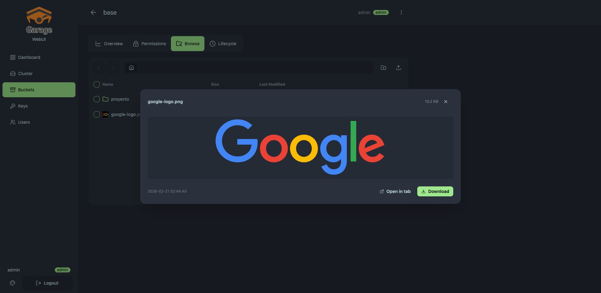

# Garage WebUI — Extensions

[](misc/img/garage-webui.png)

Extensions for [garage-webui](https://github.com/khairul169/garage-webui), the web console for [Garage](https://garagehq.deuxfleurs.fr/) S3-compatible distributed object storage. Adds multi-user RBAC, presigned URL sharing, file preview, object operations, and security hardening. Packaged as a single ~20 MB container image.

> **Extensions by:** [@leojadue](https://github.com/leojadue) — XGOLD IT
>
> **Original project:** [khairul169/garage-webui](https://github.com/khairul169/garage-webui)

---

## Original vs Extensions

| Feature | Original | Extensions |
|---------|:--------:|:----------:|
| Dashboard with cluster health | Basic | Enhanced gauges + per-bucket analytics |
| Bucket listing | Yes | Yes |
| Object browser | Yes | Yes |
| Upload / download files | Yes | Yes |
| Create folders | Yes | Yes |
| **Multi-user RBAC (admin/editor/viewer)** | — | Yes |
| **User management (create, edit, deactivate)** | — | Yes |
| **Presigned URL sharing (time-limited)** | — | Yes |
| **File preview (images, text, PDF)** | — | Yes |
| **Image thumbnails** | — | Yes |
| **Rename objects** | — | Yes |
| **Move across buckets/folders** | — | Yes |
| **Bulk delete (select-all, checkbox)** | — | Yes |
| **Folder upload (preserve structure)** | — | Yes |
| **Download folder as ZIP** | — | Yes |
| **Lifecycle rules UI (create, toggle, delete)** | — | Yes |
| **Session persistence (SQLite-backed)** | — | Yes |
| **Last-admin protection** | — | Yes |
| **Security hardening** (rate limiting, CSRF, session fixation) | — | Yes |
| Theme support | Yes | 20+ DaisyUI themes |
| Mobile responsive | Partial | Full responsive |
| Docker image | Standard | `scratch` base (~20 MB) |
| Compatible with Garage | v0.9+ | v1.x — v2.2+ |

---

## Screenshots

### Role-Based Access Control

| User Management | Create User |
|:---------------:|:-----------:|
| [](misc/img/users-table-two-users.png) | [](misc/img/create-user-dialog.png) |

| Admin Sidebar (full access) | Viewer Sidebar (read-only) |
|:---------------------------:|:--------------------------:|
| [](misc/img/sidebar-admin-rbac.png) | [](misc/img/sidebar-viewer-rbac.png) |

| Object Browser — Admin | Object Browser — Viewer |
|:-----------------------:|:-----------------------:|
| [](misc/img/browse-admin-view.png) | [](misc/img/browse-viewer-view.png) |

### Core Features

| Dashboard | Buckets | Object Browser |
|:---------:|:-------:|:--------------:|
| [](misc/img/home.png) | [](misc/img/buckets.png) | [](misc/img/buckets-browse.png) |

| Presigned Sharing | File Preview |
|:-----------------:|:------------:|
| [](misc/img/buckets-browse-sharing.png) | [](misc/img/file-preview-image.png) |

| Cluster | Access Keys |
|:-------:|:-----------:|
| [](misc/img/cluster.png) | [](misc/img/keys.png) |

<details>
<summary>Mobile Views</summary>

| Dashboard | Cluster | Buckets | Browse |
|:---------:|:-------:|:-------:|:------:|
| [](misc/img/mobile-dashboard.png) | [](misc/img/mobile-cluster.png) | [](misc/img/mobile-buckets.png) | [](misc/img/mobile-bucket-browse.png) |

</details>

---

## Features

### Multi-User RBAC

Three roles with granular permission gating at both backend (middleware) and frontend (UI) layers.

```
     admin ─── Full access: cluster, keys, users, lifecycle, API proxy
       │
     editor ── Upload, delete, rename, move objects
       │
     viewer ── Browse, download, preview, share (read-only)
```

- On first boot, an admin is auto-created from `AUTH_USER_PASS`
- Admins manage users via the **Users** page (create, edit role, deactivate, change password)
- Backend middleware returns 403 for unauthorized actions — the UI hides controls as a UX layer, not a security boundary
- Last-admin protection prevents accidentally locking yourself out
- Sessions persist across container restarts (SQLite-backed)

**Route enforcement:**

| Route | Min. Role |
|-------|-----------|
| `GET /browse/*`, `/presign/*`, `/zip/*` | viewer |
| `PUT/DELETE /browse/*`, `POST /objects/copy` | editor |
| `POST/DELETE /lifecycle/*` | admin |
| `/users/*` CRUD | admin |
| `PUT /users/{id}/password` | admin or self |
| Garage Admin API proxy | admin |

### Presigned URL Sharing

Share any file with a **time-limited, cryptographically signed URL** — works through the standard S3 endpoint.

- 7 expiration presets: 15 min to 7 days
- One-click copy to clipboard
- Open in browser button

```
GET /api/presign/{bucket}/{key}?expires=3600
→ { "url": "https://s3.domain.com/bucket/key?X-Amz-Algorithm=...", "expiresIn": 3600 }
```

### Object Operations

| Operation | Details |
|-----------|---------|
| **Rename** | In-place rename via S3 CopyObject + DeleteObject |
| **Move** | Cross-bucket and cross-folder, recursive for directories |
| **Bulk delete** | Checkbox selection, select-all, confirmation dialog |
| **Folder upload** | Preserves directory structure |
| **Create folders** | Virtual S3 prefix with trailing `/` |
| **Download as ZIP** | Server-side compression, works on folders |

### File Preview

Preview files directly in the browser without downloading:

| Type | Formats |
|------|---------|
| Images | jpg, png, gif, svg, webp (with thumbnails) |
| Text | txt, json, xml, yaml, md, csv, log |
| PDF | In-browser viewer |

### Lifecycle Rules

Full GUI for S3 lifecycle management — create, edit, toggle, and delete rules. Set object expiration days, abort incomplete multipart uploads, target by prefix.

### Dashboard

Cluster health gauges, per-bucket storage analytics (bytes, object count, percentage), and a bucket summary table — all at a glance.

### Security Hardening

- Rate limiting on login endpoint (per-IP)
- Session token regeneration on login (anti-fixation)
- `SameSite=Strict` + `Secure` session cookies
- Config endpoint redacted (no admin tokens exposed)
- Proxy routes sanitized (`showSecretKey` stripped)
- Client headers stripped before Admin API proxy
- Content-Disposition filename sanitization (RFC 6266)
- Thumbnail memory bounded (10 MB limit)

---

## Quick Start

### Docker Compose

```yaml
services:
  garage:
    image: dxflrs/garage:v2.2.0
    volumes:
      - ./garage.toml:/etc/garage.toml
      - ./meta:/var/lib/garage/meta
      - ./data:/var/lib/garage/data
    restart: unless-stopped
    ports:
      - "3900:3900"
      - "3902:3902"
    healthcheck:
      test: ["CMD", "curl", "-f", "http://localhost:3903/v2/GetClusterHealth"]
      interval: 30s
      timeout: 5s
      retries: 3

  garage-webui:
    image: leojadue/garage-webui:latest
    restart: unless-stopped
    ports:
      - "3909:3909"
    volumes:
      - ./garage.toml:/etc/garage.toml:ro
      - webui-data:/data
    environment:
      API_BASE_URL: "http://garage:3903"
      API_ADMIN_KEY: "${GARAGE_ADMIN_TOKEN}"
      S3_ENDPOINT_URL: "https://s3.yourdomain.com"
      AUTH_USER_PASS: "${GARAGE_WEBUI_AUTH}"
      DATA_DIR: "/data"
    depends_on:
      garage:
        condition: service_healthy

volumes:
  webui-data:
```

### Generate Password Hash

```bash
python3 -c "import bcrypt; print(bcrypt.hashpw(b'yourpassword', bcrypt.gensalt()).decode())"
```

Set `GARAGE_WEBUI_AUTH=admin:<hash>` in your `.env` file.

### Single-User Mode

Remove `DATA_DIR` and the volume to run without the user database — a single user authenticates via `AUTH_USER_PASS` only.

---

## Environment Variables

| Variable | Default | Description |
|----------|---------|-------------|
| `API_BASE_URL` | from garage.toml | Garage Admin API endpoint |
| `API_ADMIN_KEY` | from garage.toml | Garage Admin API token |
| `S3_ENDPOINT_URL` | from garage.toml | **Public** S3 endpoint for presigned URLs |
| `AUTH_USER_PASS` | _(disabled)_ | `username:bcrypt_hash` — enables authentication |
| `DATA_DIR` | _(disabled)_ | Data directory path — enables multi-user RBAC |
| `COOKIE_SECURE` | `true` | Set to `false` for local dev without HTTPS |
| `BASE_PATH` | _(empty)_ | URL prefix for reverse proxy setups |
| `PORT` | `3909` | HTTP listen port |
| `HOST` | `0.0.0.0` | Listen address |

> `S3_ENDPOINT_URL` must be the **publicly reachable** S3 API URL. Presigned URLs use this endpoint and must be accessible from the end user's browser.

---

## Architecture

```
┌─────────────────────────────────────────────────────┐
│                      Browser                         │
│            garage.domain.com:3909                    │
└────────┬───────────────────────────────┬─────────────┘
         │  React + DaisyUI + TanStack   │  Presigned URL
         │  usePermission() → role gate  │  (direct S3)
         ▼                               ▼
┌───────────────────────┐     ┌───────────────────────┐
│    Go Backend :3909   │     │   Garage S3 :3900     │
│                       │     │   AWS Sig V4 auth     │
│  Rate Limiter ─────────┤     └───────────────────────┘
│  Auth Middleware ──────┤
│  Role Middleware ──────┤
│  SQLite Sessions ──────┤
│                       │
│  /api/browse/   ──────┤── S3 SDK
│  /api/presign/  ──────┤── S3 SDK (presign)
│  /api/users/    ──────┤── SQLite
│  /api/*         ──────┤── Safe proxy → Admin API
└───────────────────────┘
         │
         ▼
┌───────────────────────────┐
│     Garage Server         │
│  :3903 Admin  :3900 S3    │
└───────────────────────────┘
```

### Boot Sequence (Multi-User)

```
1. DATA_DIR=/data → SQLite database created at /data/webui.db
2. Migrations run (roles + users + sessions tables)
3. 3 roles seeded: admin, editor, viewer
4. AUTH_USER_PASS parsed → admin user inserted if not exists
5. Server starts on :3909
```

---

## Tech Stack

| Layer | Technology |
|-------|-----------|
| Frontend | React 18, TypeScript 5.5, Vite 5, Tailwind CSS 3, DaisyUI 4, TanStack React Query |
| Backend | Go 1.23, AWS SDK v2, `modernc.org/sqlite` (pure Go) |
| Sessions | `alexedwards/scs/v2` — SQLite-backed, persistent |
| Auth | bcrypt hashing, HTTP-only session cookies, rate limiting |
| Container | Multi-stage build → `scratch` base (~20 MB) |

---

## API Reference

### Public

| Method | Endpoint | Description |
|--------|----------|-------------|
| POST | `/api/auth/login` | Authenticate (rate-limited) |
| GET | `/api/auth/status` | Session status + user info |

### Viewer

| Method | Endpoint | Description |
|--------|----------|-------------|
| GET | `/api/browse/{bucket}` | List objects |
| GET | `/api/browse/{bucket}/{key}` | Download / preview |
| GET | `/api/presign/{bucket}/{key}` | Generate presigned URL |
| GET | `/api/zip/{bucket}` | Download folder as ZIP |
| GET | `/api/lifecycle/{bucket}` | View lifecycle rules |

### Editor

| Method | Endpoint | Description |
|--------|----------|-------------|
| PUT | `/api/browse/{bucket}/{key}` | Upload |
| DELETE | `/api/browse/{bucket}/{key}` | Delete |
| POST | `/api/objects/copy` | Copy / move / rename |

### Admin

| Method | Endpoint | Description |
|--------|----------|-------------|
| POST/DELETE | `/api/lifecycle/{bucket}` | Manage lifecycle rules |
| GET/POST/PUT/DELETE | `/api/users/*` | User management |
| GET | `/api/roles` | List roles |
| * | `/api/*` | Proxy to Garage Admin API |

---

## License

[MIT License](LICENSE). Extended fork of [khairul169/garage-webui](https://github.com/khairul169/garage-webui).
